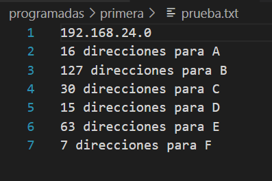
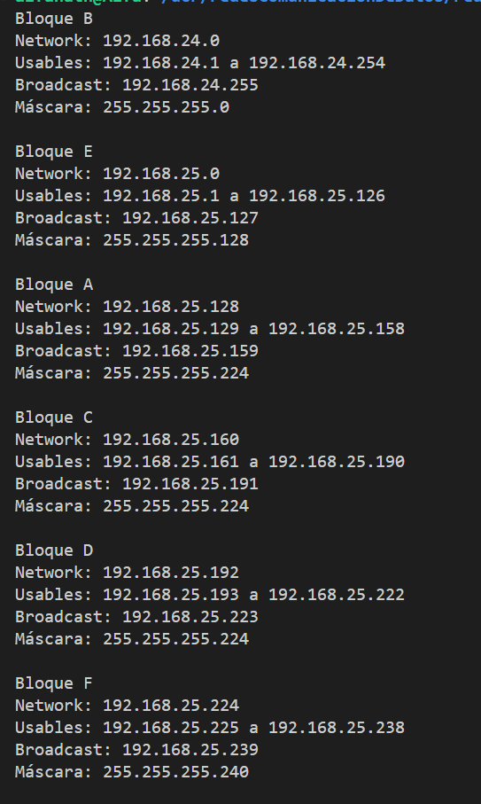
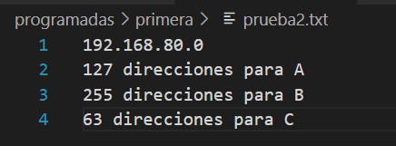
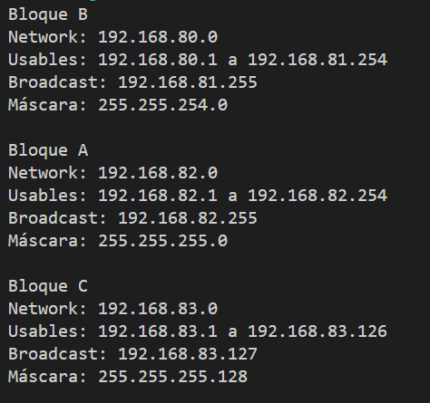

# Algoritmo de Subneteo

El presente código es el algoritmo de subnetear como se hizo en clases, donde nos proporcionan una IP base para empezar a trabajarla con diversos bloques, estos bloques contienen una cantidad de solicitudes (un número) y el nombre de cada bloque se representa con una letra mayúscula del alfabeto.

Las solicitudes deben ir de mayor a menor, además a cada una se le debe sumar un 2 y se debe verificar en cuál potencia de 2 cabe ese resultado, por ejemplo:

```
Bloque B: 127 direcciones
127 + 2 = 129
2^7 = 128 -> Aquí no cabe el 129
2^8 = 256 -> Aquí sí cabe el 129
```

Con base al análisis anterior, es como se debe asignar la cantidad final de direcciones a cada bloque.

Después de que cada bloque sabe su cantidad de direcciones, se procede a clasificarlas y se muestra su red específica, entonces en cada bloque se puede observar la Network, el rango de direcciones usables y la Broadcast.

Entonces a la IP base, en su último segmento se le van sumando las solicitudes, pero si este llega a 256 solicitudes, nos pasamos al penúltimo segmento de la IP y le aumentamos una unidad y al último segmento se le reinicia en 0, por ejemplo:

```
IP base: 192.168.24.0

Bloque B tiene 256 direcciones:
    Network: 192.168.24.0
    Usables: 192.168.24.1 a 192.168.24.254
    Broadcast: 192.168.24.255
```

Como llegamos al límite de 256 direcciones, en el penúltimo segmento hay que aumentarle una unidad como se muestra a continuación, y así para las demás IP que se vayan creando:

```
Bloque E tiene 128 direcciones:
    Network: 192.168.25.0
    Usables: 192.168.25.1 a 192.168.25.126
    Broadcast: 192.168.25.127
```

El programa se compila y ejecuta con Makefile, a continuación los comandos:

- Primeramente posicionarse en la terminal en la carpeta "primera".
- Luego digitar en la terminal ` make ` para compilar.
- Por último vamos a ejecutarlo con ` ./subneteo `.

En caso de tener problemas con Fedora o Ubuntu, hay que instalar el compilador:

```
sudo dnf install gcc-c++    # Fedora

sudo apt install g++        # Ubuntu/Debian
```

Cuando ejecutamos el programa (Se prueba por defecto el archivo prueba.txt), este lee la entrada con los datos del archivo de texto, el cual contiene en la primera línea la dirección base sobre la cual se va a trabajar y en las siguientes líneas se tienen los bloques nombrados con letras y la cantidad de direcciones/solicitudes iniciales, ejemplo de la entrada:




El ejemplo de salida sería cada bloque en orden ascendente según su cantidad de solicitudes más la clasificación de sus solicitudes:



Si se desea probar la segunda prueba, hay que ir al codigo en el `main` y cambiar el nombre del archivo de texto que se pasa en la línea `ifstream archivo("prueba.txt");`, entonces debería quedar como  `ifstream archivo("prueba2.txt");`, su es entrada:



Y su salida es:

